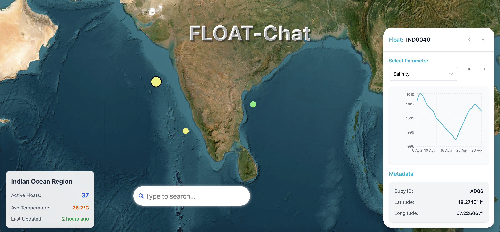

# Float-Chat

A React-based web application for visualizing and interacting with oceanographic float data. This application provides an intuitive interface for searching and analyzing buoy data from ocean monitoring floats.

## Features

- **Interactive Search**: Search functionality for ocean float data
- **Data Visualization**: Real-time charts and graphs for oceanographic parameters
- **Buoy Dashboard**: Detailed metadata and parameter visualization for individual floats
- **Regional Overview**: Statistics for active floats in different ocean regions
- **Responsive Design**: Modern UI with Tailwind CSS styling

## Tech Stack

- **Frontend**: React 19.1.1 with Vite
- **Styling**: Tailwind CSS 4.1.13
- **Charts**: Recharts for data visualization
- **Icons**: Lucide React and React Icons
- **Routing**: React Router DOM
- **Animation**: GSAP for smooth animations

## Prerequisites

Before running this application, make sure you have the following installed:

- **Node.js** (version 16.x or higher)
- **npm** or **yarn** package manager

## Installation

1. **Clone the repository**:
   ```bash
   git clone <repository-url>
   cd Float-Chat
   ```

2. **Install dependencies**:
   ```bash
   npm install
   ```
   or
   ```bash
   yarn install
   ```

## Running the Application

### Development Mode

To start the development server with hot reload:

```bash
npm run dev
```

The application will be available at `http://localhost:5173`

### Build for Production

To create a production build:

```bash
npm run build
```

### Preview Production Build

To preview the production build locally:

```bash
npm run preview
```

### Linting

To run ESLint for code quality checks:

```bash
npm run lint
```

## Project Structure

```
src/
├── components/
│   ├── Home/
│   │   ├── SearchBar.jsx          # Search functionality component
│   │   ├── SearchBar.css          # Search bar styling
│   │   ├── Video.jsx              # Background image display
│   │   ├── buoy-data-dashboard.jsx # Buoy data visualization dashboard
│   │   └── select.jsx             # Custom select component
│   └── ui/
│       ├── button.jsx             # Reusable button component
│       └── card.jsx               # Reusable card component
├── pages/
│   └── Home.jsx                   # Main home page
├── lib/
│   └── utils.js                   # Utility functions
├── assets/
│   └── react.svg                  # Static assets
├── App.jsx                        # Main app component
├── main.jsx                       # Application entry point
└── index.css                      # Global styles
```

## Key Components

### SearchBar
- Interactive search functionality
- Fetches data from JSONPlaceholder API (demo data)
- Shows notification when backend is not connected
- Real-time filtering of results

### BuoyDataDashboard
- Displays oceanographic parameters (pressure, temperature, salinity)
- Interactive charts using Recharts
- Metadata display for individual floats
- Parameter selection dropdown

### Home Page
- Background ocean map visualization
- Regional statistics overview
- Integrated search and dashboard components
- Responsive layout design

## Screenshots

Homepage  

## Configuration

The application uses:
- **Vite** for fast development and building
- **Tailwind CSS** for utility-first styling
- **ESLint** for code linting with React-specific rules
- **React Router** for client-side routing

## Available Scripts

- `npm run dev` - Start development server
- `npm run build` - Build for production
- `npm run lint` - Run ESLint
- `npm run preview` - Preview production build

## Browser Support

This application supports all modern browsers that support ES2020 features.

## Contributing

1. Fork the repository
2. Create a feature branch (`git checkout -b feature/new-feature`)
3. Commit your changes (`git commit -am 'Add new feature'`)
4. Push to the branch (`git push origin feature/new-feature`)
5. Create a Pull Request

## License

This project is licensed under the MIT License.

## Future Enhancements

- [ ] Connect to real oceanographic data API
- [ ] Add more chart types and visualization options
- [ ] Implement user authentication
- [ ] Add data export functionality
- [ ] Mobile app version
- [ ] Real-time data streaming

## Support

For questions or issues, please open an issue in the repository or contact the development team.